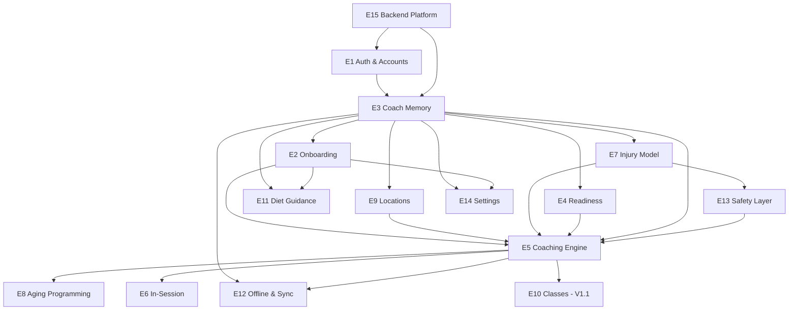

# AI Health Coach — Build Plan (Claude Code)

A sequencing and parallelization plan for implementing the backlog in `v1-mvp.md` and `v1.1-full-release.md`, optimized for building with Claude Code.

**Stack (locked):**

- **Client:** Android native, Kotlin + Jetpack Compose, first-class Health Connect.
- **Backend:** Go service, MySQL database. Holds the Claude API key, assembles Coach Memory into prompts, calls Claude, runs the deterministic safety layer, persists data.
- **Repo:** Monorepo — `/android`, `/backend`, `/docs` (move `user-stories/` here).

---

## 1. How to read this plan

Work proceeds in **waves**. Everything inside a wave can run in parallel; a wave should not start until the waves it depends on are functionally done (interfaces stable, not necessarily polished). Each epic also splits into a **backend track** and an **Android track** that can often progress in parallel within the same wave once the API contract is agreed.

Claude Code workflow: use a **git worktree per parallel stream** (one per epic or track) so multiple sessions don't collide. Agree the API contract (OpenAPI/proto or a shared markdown) at the start of each wave so backend and Android can build against it independently.

---

## 2. Epic dependency analysis

| Epic | Title | Depends on | Can parallelize with |
|---|---|---|---|
| E15 | Backend Platform & Observability | — (foundational) | E1 (after skeleton) |
| E1 | Auth, Accounts & Privacy | E15 | E3 schema design |
| E3 | Coach Memory | E15, E1 | — (gates Wave 1) |
| E2 | Adaptive Onboarding & User Model | E3 | E4, E7, E9, E11, E13 |
| E4 | Recovery & Readiness (Health Connect) | E3 | E2, E7, E9, E11, E13 |
| E7 | Injury & Condition Management | E3 (+ E13 for safety) | E2, E4, E9, E11 |
| E9 | Training Locations & Equipment | E3 | E2, E4, E7, E11, E13 |
| E11 | Diet & Nutrition Guidance | E2 (prefs), E3 | E4, E7, E9, E13 |
| E13 | Safety & Compliance Layer | — (deterministic; coordinate with E7) | E2, E4, E9, E11 |
| E5 | Coaching Engine & Session Generation | E3, E13, E4, E7, E9, E2 | E8 (same effort) |
| E8 | Healthy-Aging / Longevity Programming | E5, E2 | E5 (built together) |
| E6 | In-Session Experience | E5 (UI scaffold can start on mock) | E12, E14 |
| E12 | Offline, Sync & Caching | E5, E3 | E6, E14 |
| E14 | Settings & Profile Management | E2, E3 | E6, E12 |
| E10 | Classes (Equinox) — V1.1 | E5 | other V1.1 work |

**Critical path:** E15 → E1 → E3 → E5 → E6. Everything else hangs off branches of this spine. E5 is the integration hub and the main bottleneck; protect it by finishing its inputs (E3, E13, E4, E7, E9, E2) first.

---

## 3. Dependency graph

---

## 4. Execution waves (MVP)

### Wave 0 — Foundations *(sequential-ish; gates everything)*
**Epics:** E15, E1, E3
Build the monorepo, Go service skeleton, MySQL schema + migrations, config/secrets handling (Claude key server-side only), auth, and the Coach Memory store with prompt-assembly stub.
- Parallel within wave: once the Go skeleton + DB exist, E1 (auth) and the E3 schema design proceed together; E3 store completes after E1 identity lands.
- **Exit criteria:** a user can sign up/log in; the backend can read/write a versioned Coach Memory record tied to an account; CI runs.

### Wave 1 — Inputs & data capture *(highly parallel)*
**Epics:** E2, E4, E7, E9, E13, E11
All read/write Coach Memory and are independent of each other. Run each in its own worktree.
- E13 (safety) and E7 (injury) coordinate on the contraindication rule shape — agree that interface first.
- E4 has a heavy Android Health Connect piece plus a backend readiness-compute piece; split across tracks.
- E11 needs E2's diet-preference field, so start E11 slightly after E2's model lands (or stub the field).
- **Exit criteria:** onboarding writes a complete user model; readiness computes from Health Connect; injuries parse to structured memory; locations/equipment switchable; safety rules callable; diet targets compute.

### Wave 2 — Coaching engine *(focused, low parallelism)*
**Epics:** E5, E8
The integration hub. Assemble Coach Memory + readiness + injuries + location/equipment into the prompt, call Claude, produce a full session (warmup, main with loads/reps/rests, accessory, aging block, reasoning), run it through the E13 safety layer, cache it. E8 (aging programming) is built as part of the generation logic, not separately.
- Keep this mostly single-stream to preserve coherence; Android can build the session-preview UI against a fixed JSON sample in parallel.
- **Exit criteria:** tapping "Start workout" returns a validated, cached session with reasoning; re-planning triggers fire.

### Wave 3 — Execution & dependent features *(parallel)*
**Epics:** E6, E12, E14
- E6 in-session (logging, timers, rest countdowns) — UI scaffold may have started in Wave 1–2 on a mock; now wire to real sessions.
- E12 offline/sync — depends on E5 caching and E3 sync.
- E14 settings — edit any user-model field.
- **Exit criteria:** a full session runs and logs end-to-end offline and syncs back; all model fields editable. **This is the MVP cut.**

### Wave 4 — V1.1
**Epics:** E10 (Classes) + enhancement stories across all epics (multi-wearable E4-S5, periodization/plateau E5-S6/S7, temporal check-ins E7-S6, richer privacy E1-S7..S10, observability E15-S4..S6, etc.).
Most V1.1 stories attach to an already-built epic and can parallelize freely.

---

## 5. What parallelizes vs. what doesn't

**Safe to run concurrently (separate worktrees/sessions):**
- All of Wave 1 (E2, E4, E7, E9, E13, E11).
- Within any epic, the backend track and the Android track once the API contract is fixed.
- Wave 3 (E6, E12, E14).
- Most V1.1 enhancements.

**Keep serialized / coordinated:**
- Wave 0 spine (E15 → E1 → E3) — everything depends on it; don't fan out before Coach Memory is stable.
- E5/E8 (Wave 2) — single coherent effort; it touches every input contract.
- E13 ↔ E7 contraindication interface — agree before either ships.

---

## 6. Per-wave Claude Code prompts

Use `KICKOFF-PROMPT.md` to start (scaffold + Wave 0). After each wave, open the next with a prompt like the templates below. Run parallel epics each in their own `git worktree` + Claude Code session.

**Wave 1 (per epic, e.g. injuries):**
> Read `/docs/user-stories/v1-mvp.md` and `BUILD-PLAN.md`. Implement Epic E7 (Injury & Condition Management) for MVP — stories E7-S1..S5 — across the Go backend and Android client. Coach Memory (E3) and the safety layer interface (E13) already exist; use them. Agree the contraindication rule shape with E13 before coding. Produce a short plan, then implement with tests. Do not touch other epics' code.

**Wave 2 (engine):**
> Read `/docs/user-stories/v1-mvp.md` and `BUILD-PLAN.md`. Implement Epic E5 (Coaching Engine) and E8 (Aging Programming) for MVP. Assemble Coach Memory + readiness + injuries + location/equipment into the Claude prompt server-side, generate a full session, validate it through the E13 safety layer, and cache it. Build against the existing E3/E4/E7/E9/E13 interfaces. Provide a fixed sample session JSON so the Android team can build the preview UI in parallel.

**Wave 3 (per epic):**
> Read `/docs/user-stories/v1-mvp.md` and `BUILD-PLAN.md`. Implement Epic E6 (In-Session Experience) for MVP — E6-S1..S5 — wiring the Android execution UI to real cached sessions from E5. Logging, rest countdowns, and timed-exercise timers must work fully offline.

---

## 7. Conventions & definition of done

- **Reference docs:** keep `user-stories/` under `/docs`; every PR cites the story IDs it satisfies (e.g. "implements E5-S1, E5-S3").
- **API contract first:** each wave starts by fixing/extending the API contract so backend and Android proceed independently.
- **Secrets:** Claude API key lives only in backend config; never in the Android app or the repo.
- **Tests:** backend handlers and the safety layer (E13) get unit tests; the safety layer must have tests proving unsafe plans are corrected/rejected.
- **Story done =** acceptance criteria met, tests passing, story IDs referenced in the PR, and (for user-facing flows) the relevant disclaimer language present.
- **Offline-first:** any in-session feature must be verified to work with connectivity disabled.
